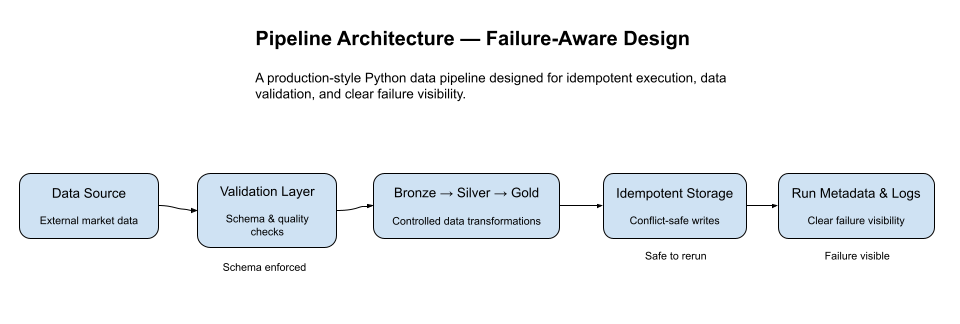
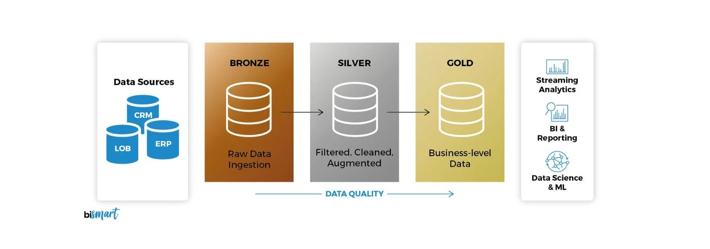
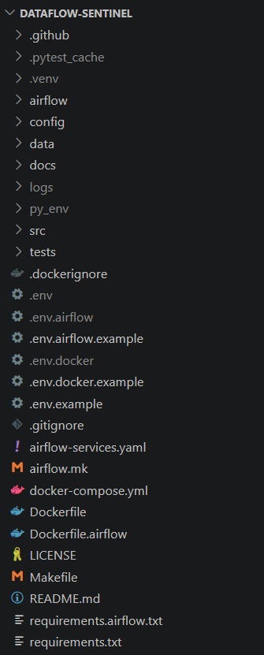
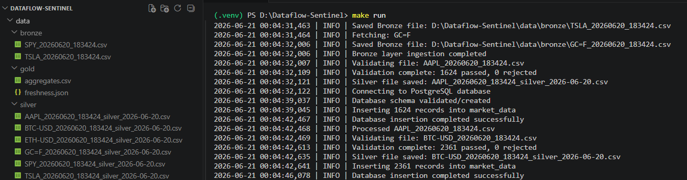
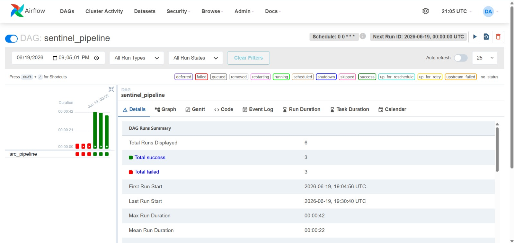

# DATAFLOW-SENTINEL

Production-Inspired DataOps Pipeline with Freshness Monitoring & CI Alerting

---

## Overview

**DATAFLOW-SENTINEL** > A production-inspired DataOps pipeline that ingests financial market data, validates schema integrity, promotes datasets through a Medallion Architecture, and enforces freshness monitoring via CI-based alerting.


Modern pipelines often *run* but silently degrade — schemas drift, data becomes stale, and failures go unnoticed.

This system is designed to:

* Detect failures early
* Prevent silent data corruption
* Enforce schema validation
* Guarantee safe re-runs (idempotency)
* Surface freshness violations via CI alerts

The focus is not just moving data — but protecting its integrity.

---

## Why This Project Matters

Most beginner pipelines demonstrate ingestion.

This project demonstrates:

* Validation-first data promotion
* Deterministic orchestration
* Idempotent re-execution
* Structured logging for traceability
* CI-driven monitoring and alerting
* Environment parity (Local ↔ Docker ↔ CI)
* **Production-grade orchestration with Apache Airflow and Github Actions**

It simulates a production-grade DataOps project in a compact, readable system.

---

## Architecture

### System Architecture


---

### Medallion Data Model


--


The pipeline follows a **Medallion Architecture**:

**Bronze → Silver → Gold**

**Bronze**
Immutable raw market data from Yahoo Finance

**Silver**
Schema-enforced and validated datasets

**Gold**
Analytics-ready aggregates and freshness monitoring artifacts

Execution is orchestrated via `src/pipeline.py` and runs identically across:

* Local environment
* Docker container
* GitHub Actions (scheduled CI runs)
* Apache Airflow, which executes the pipeline as a (DAG).

📄 Detailed architecture: `docs/ARCHITECTURE.md`

---

## Reliability Guarantees

The system is intentionally designed to fail loudly.

* Safe re-runs (idempotent writes and controlled promotion)
* Validation gates prevent downstream corruption
* Structured logs for debugging and auditability
* Freshness tracking via `data/gold/freshness.json`
* CI alerts on failure
* Retries and task-level failure alerts

No silent degradation.

---

## Project Structure




```
src/        Core pipeline logic ingestion, validation, storage, Metrics
data/       Bronze / Silver / Gold
tests/      Pytest-based unit & integration tests
config/     Runtime / assets configuration (assets.yaml)
logs/       Structured execution logs
docs/       Architecture & operational runbook
airflow/    Orchestration logic and Dag file
```

The structure enforces strict separation of concerns and stage isolation.

---

## Pipeline Flow

1. **Ingestion**

   * Pulls market data via `yfinance`
   * Writes immutable datasets to Bronze

2. **Validation**

   * Enforces schema with Pydantic
   * Blocks invalid datasets

3. **Promotion**

   * Bronze → Silver → Gold
   * Centralized storage abstraction controls writes

4. **Metrics**

   * Computes aggregates
   * Calculates freshness indicators

5. **Monitoring**

   * Writes `freshness.json`
   * Triggers CI-based email alerts when needed


### Gold Layer Output Example (freshness Artifact)


---

## How to Run

The pipeline can be executed in **four different ways**, depending on your needs:

| Mode | Command(s) | Database | Dependencies |
|------|------------|----------|--------------|
| **Local** | `make test` + `make run` | Neon PostgreSQL | Python + requirements.txt |
| **Docker** | `make docker_all` | Local PostgreSQL (container) | Docker only |
| **CI (GitHub Actions)** | Manual trigger from Actions tab | Neon PostgreSQL | None (runs in cloud) |
| **Airflow** | `make up`, `make trigger`, etc. | Neon PostgreSQL (or custom) | Python + Docker |

---

### 1. Local Run (Development)

This is the standard way to develop and test the pipeline on your own machine.

#### Prerequisites
- Python 3.11 installed
- Git (to clone the repository)

#### Steps
1. **Clone the repository** (if not already done):
   ```bash
   git clone <repository-url>
   cd DATAFLOW-SENTINEL
   ```

2. **Set up a Python virtual environment** (optional but recommended):
   - On Linux/macOS:
     ```bash
     python -m venv venv
     source venv/bin/activate
     ```
   - On Windows:
     ```bash
     python -m venv venv
     .\venv\Scripts\activate
     ```

3. **Install dependencies**:
   ```bash
   pip install -r requirements.txt
   ```

4. **Configure environment** – copy `.env.example` to `.env` and fill in your credentials (especially `POSTGRES_*` for Neon). The local run connects to **Neon PostgreSQL** by default.

5. **Run tests** (optional but recommended):
   ```bash
   make test
   ```
   This ensures all modules are working correctly.

6. **Execute the pipeline**:
   ```bash
   make run
   ```

The pipeline will ingest data, validate, promote, and produce gold outputs. Logs are stored in `logs/`.


*Example terminal output after a successful local run.*

---

### 2. Docker Run (Containerized, No Installation)

If you want to run the pipeline **without installing anything locally** (except Docker), use this method.

#### Prerequisites
- Docker and Docker Compose installed

#### Steps
1. **Build, run, test, and clean** – all in one command:
   ```bash
   make docker_all
   ```

   This internally executes (in order):
   - `make docker_test` – runs tests inside the container
   - `make docker_run` – executes the pipeline
   - `make docker_clean` – removes temporary artifacts

2. **Database**: This run uses a **local PostgreSQL container** (defined in `docker-compose.yaml`), so you don't need to set up external database credentials.

No Python or dependencies are needed on your host machine – everything runs inside the container.


*Example Docker run logs showing the pipeline executing inside the container.*

---

### 3. CI (GitHub Actions)

The pipeline is automatically scheduled to run daily, but you can also trigger it manually.

#### Manual Trigger
1. Go to the repository on GitHub.
2. Click the **Actions** tab.
3. Select the workflow (e.g., `sentinel-pipeline.yml`).
4. Click **Run workflow** → select branch → **Run**.
5. The workflow will:
   - Run tests (`pytest`)
   - Execute the full pipeline
   - Produce artifacts (logs, freshness.json) which are **automatically deleted after a set retention period**

#### Scheduled Runs
- The pipeline runs every day at the configured time.
- On success/failure, you receive email notifications (configured via GitHub Actions).

**Database**: This run connects to **Neon PostgreSQL** (same as local), using secrets stored in GitHub.


*Example of a successful GitHub Actions workflow run with test and pipeline steps.*

---

### 4. Airflow (Production Orchestration)

For full orchestration with Apache Airflow, use this method. It runs the pipeline as a DAG with retries, UI monitoring, and task-level logs.

#### Prerequisites
- Python 3.11 installed (for local Airflow client)
- Docker and Docker Compose (to run the Airflow stack)

#### Steps

1. **Install local dependencies** (for Airflow CLI and environment management):
   ```bash
   pip install -r requirements.txt
   ```
   (This also installs the `apache-airflow` package if not already present.)

2. **Set up Airflow** – copy the example environment file and adjust if needed:
   ```bash
   cp .env.airflow.example .env.airflow
   ```
   This file contains Airflow-specific overrides (database URL, DAG location, etc.).

3. **Start the Airflow stack** (webserver, scheduler, PostgreSQL metadata DB):
   ```bash
   make up
   ```
   This spins up containers defined in `docker-compose.yaml` (using `Dockerfile.airflow`).  
   Wait a few seconds for services to become ready.

4. **Access the Airflow UI**:
   Open your browser and go to [http://localhost:8080](http://localhost:8080).  
   Log in using the credentials you set (see `.env.airflow` for defaults).

5. **Trigger the DAG**:
   - **Via UI**: In the DAGs list, click the ▶ (play) button next to `sentinel_dag`.
   - **Via CLI** (from your terminal):
     ```bash
     make trigger
     ```
     This runs `airflow dags trigger sentinel_dag` inside the scheduler container.

6. **Monitor execution**:
   - In the UI, click on the DAG run to see task statuses, logs, and the graph view.
   - **Logs** are accessible per task – helpful for debugging.
   - Use the following terminal commands for container health:
     - `make status` – shows container status
     - `make logs` – streams logs from all containers

7. **Stop the Airflow stack** when done:
   ```bash
   make down
   ```

**Database**: By default, Airflow uses the same **Neon PostgreSQL** as the local run (configured via environment). You can change it in `.env.airflow` if needed.


*Airflow UI showing the sentinel_dag with task statuses and the graph view.*

---

### Summary of Makefile Commands

| Command | Purpose |
|---------|---------|
| `make test` | Run tests locally |
| `make run` | Execute pipeline locally |
| `make docker_all` | Build, test, run, and clean in Docker |
| `make up` | Start Airflow containers |
| `make down` | Stop Airflow containers |
| `make trigger` | Trigger the Airflow DAG |
| `make status` | Check Airflow container status |
| `make logs` | View Airflow container logs |

Choose the run mode that best suits your workflow. For most development, start with **local**; for CI‑like validation, use **Docker**; for production‑grade scheduling, use **Airflow**.

---

### Configuration

**Assets**

Defined in:

```
config/assets.yaml
```

This decouples runtime symbols (e.g., ticker symbols, file paths datetime) from pipeline logic.

---

### Environment Variables

Multiple environment files are provided for different contexts:

# File Purpose
* .env Base defaults (used in local runs)
* .env.airflow Overrides for Airflow execution
* .env.docker Overrides for Docker‑compose runs

Sensitive values (like SENTRY_DSN) should never be committed; instead, use GitHub Secrets for CI runs.

---

### Testing

* Built with **pytest**
* Tests mirror the `src/` structure
* Covers ingestion, validation, storage and gold_metrics
* Enforced in CI to prevent regressions

Run tests locally:

```bash
pytest tests/
```

---

### Observability

* Structured logs in `logs/`
* Data freshness tracking in `data/gold/freshness.json`
* CI email alerts on failure
* Airflow UI for real‑time task monitoring and runs

Operational response guide:

📄 `docs/RUNBOOK.md`

---

## Error Monitoring (Sentry)

The pipeline integrates **Sentry** for real-time error tracking and release monitoring.


While CI alerts notify on workflow failures, Sentry captures:

* Unhandled runtime exceptions
* Full stack traces with context
* Commit-level release tracking

This ensures that failures inside the pipeline are visible even outside CI logs.

### How It Works

* `src/monitoring.py` initializes Sentry at application startup
* DSN is injected via environment variables
* GitHub Actions attaches the current commit SHA as the release version
* Errors are automatically reported on uncaught exceptions

Monitoring is isolated from business logic to maintain clean architecture separation.

### Environment Variables

```
SENTRY_DSN=
ENV=development
SENTRY_RELEASE=

```

Sentry is optional in local development and activates only when `SENTRY_DSN` is provided.

---

## Tech Stack

**Language**

* Python

**Core Libraries**

* pandas
* Pydantic
* yfinance
* SQLAlchemy
* python-dotenv

**Orchestration**

* Apache Airflow
* GitHub Actions

**Infrastructure**

* PostgreSQL (Local & Neon)
* Docker & Docker Compose
* pytest
* Sentry
* Makefile
* Git & GitHub
* yaml 

---

## Design Principles

* Deterministic execution
* Idempotent re-runs
* Validation-first promotion
* Configuration over hard-coded values
* Reproducible environments
* Fail fast, fail visibly

---

## Limitations

* No real-time ingestion
* No dashboard UI
* Limited anomaly detection beyond freshness
* Optimized for clarity and reliability over scale

---

## Future Improvements

* Replace simulated ingestion with additional external APIs
* Add anomaly-based monitoring
* Integrate observability dashboards (Grafana)
* Expand alert channels (Slack / Discord)

---

## Final Note

This project prioritizes reliability, validation, and operational discipline over scale.
It is intentionally designed to reflect how real-world data systems fail —
and how they should be protected.

---

## License

MIT License
