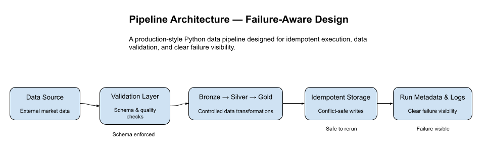
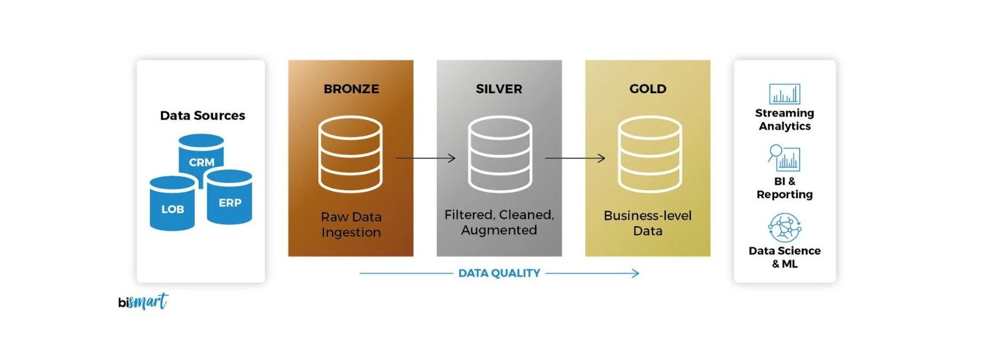

# Dataflow Sentinel — Architecture

## 1. Overview

**Dataflow Sentinel** is a production‑oriented **data pipeline and monitoring system** that ingests raw data, validates it, transforms it through layered storage (Bronze → Silver → Gold), and continuously tracks **data freshness and data quality**.

The project mirrors a real‑world **DataOps / Data Engineering** system and emphasizes:

* Deterministic execution
* Idempotent re‑runs
* Clear separation of concerns
* Validation‑first data promotion
* Containerized reproducibility
* CI‑driven automation with Github Actions
* **Production‑grade orchestration with Apache Airflow**
* **SQL-based analytical modeling with dbt on BigQuery**

The system is intentionally compact but architected using production principles.

---

## 2. High-Level Architecture



```

External Data Source
        │
        ▼
 ┌────────────┐
 │ Ingestion  │  (src/ingestion.py)
 └────────────┘
        │
        ▼
 ┌────────────┐
 │ Validation │  (src/validation.py)
 └────────────┘
        │
        ▼
 ┌────────────┐
 │  Storage   │  (src/storage.py)
 │ Bronze     │
 │ Silver     │
 │ Gold       │
 └────────────┘
        │
        ▼
 ┌────────────┐
 │  Metrics   │  (src/gold_metrics.py)
 └────────────┘
        │
        ▼
 ┌────────────┐
 │ Monitoring │  (freshness.json)
 └────────────┘
        │
        ▼ (Silver, separately)
 ┌────────────┐
 │  Export    │  (warehouse_export/export_to_bigquery.py)
 └────────────┘
        │
        ▼
 ┌────────────┐
 │  BigQuery  │  (sentinel_raw dataset)
 └────────────┘
        │
        ▼
 ┌────────────┐
 │    dbt     │  (sentinel_dbt/ staging + marts)
 └────────────┘
```

The pipeline is **orchestrated by Apache Airflow and deployed on Github Actions**, which runs the tasks in a (DAG) and scheduled runs on actions. Each task encapsulates a specific stage of the pipeline. The underlying business logic resides in the `src/` modules.

The same orchestration logic is used across:

* Local development (via `make run` – runs `pipeline.py` directly)
* Airflow (via `make up` – full stack)
* Docker (pipeline‑only container)
* GitHub Actions (scheduled CI runs)

This guarantees **behavioral parity across environments**.

The dbt/BigQuery analytics layer (bottom branch) is a **separate, independently run addition**. It reads Silver data from Neon but is not wired into the Airflow DAG or GitHub Actions workflow — it runs manually, on its own schedule, and cannot affect the core pipeline's behavior.

---

## 3. Data Layers (Medallion Architecture)



The pipeline follows the **Bronze → Silver → Gold** medallion pattern to ensure reliability and traceability.

### Bronze Layer (`data/bronze/`)

* Raw, minimally processed data
* Closest representation of the source
* Immutable audit and recovery layer
* No transformation logic applied

### Silver Layer (`data/silver/`)

* Cleaned and validated datasets
* Schema enforcement and quality checks applied
* Safe for analytical consumption
* No business aggregation logic
* Persisted to Neon PostgreSQL — the only layer with a durable database table; also the source for the dbt/BigQuery analytics layer (Section 14)

### Gold Layer (`data/gold/`)

* Aggregated, analytics‑ready outputs
* Derived from validated Silver datasets
* Regenerated as run-time artifacts on every pipeline execution (not persisted to Postgres)
* Example artifacts:

  * `aggregates.csv`
  * `freshness.json`

This layered model:

* Prevents corrupted data from reaching analytics
* Improves debuggability
* Enables safe reprocessing from any layer
* Decouples ingestion from business logic

---

## 4. Orchestration (Apache Airflow / Github Actions)

### Pipeline Orchestrator (`src/pipeline.py`)

* Single entry point of the system

* Enforces strict execution order:

  1. Ingestion
  2. Validation
  3. Storage (Bronze → Silver → Gold)
  4. Metrics generation

The Actions/DAG is scheduled daily (or can be manually triggered) and includes:

* Retry logic (configurable)
* Task‑level logging and error handling
* Clear dependency management
* Integration with the Airflow UI for monitoring

### Airflow Environment

Configuration is managed via:

* `.env.airflow` – environment overrides for Airflow services
* `airflow-services.yaml` – service definitions
* `Dockerfile.airflow` – custom Airflow image with dependencies

### Makefile Helpers

* `make up` – starts the full Airflow stack (webserver, scheduler, PostgreSQL)
* `make trigger` – triggers the DAG manually via CLI
* `make down` – stops the stack
* `make logs` – views container logs

### GitHub Actions automates the pipeline without manual intervention:

* **Scheduled runs** – daily execution
* **Manual dispatch** – on‑demand trigger
* **Pre‑execution tests** – runs pytest before the pipeline
* **Alerts** – email notifications on success or failure

Workflows are defined in `.github/workflows/`:
- `sentinel-pipeline.yml` – main pipeline execution
- `pipeline-alerts.yml` – monitoring and alerting

The dbt/BigQuery analytics layer is **not** included in these workflows at this time (see Section 14 and Section 15, Future Extensions).

---

## 5. Core Modules

### 5.1 Pipeline Orchestrator (`src/pipeline.py`)

* **Legacy entry point** – originally the main runner; now used as a library for direct local execution (`make run`).
* Encapsulates the full pipeline flow (ingestion → validation → storage → metrics).
* Guarantees idempotent re‑execution when run standalone.

### 5.2 Ingestion (`src/ingestion.py`)

* Fetches or simulates external data sources (Yahoo Finance).
* Writes exclusively to the Bronze layer.
* Fully isolated from validation and transformation logic.
* Designed for easy replacement with real APIs or streaming systems.

### 5.3 Validation (`src/validation.py`)

* Gatekeeper between Bronze and Silver.
* Enforces data quality before promotion.
* Includes:

  * Required field validation
  * Data type enforcement
  * Schema validation via **Pydantic models**
  * Non‑empty dataset checks

Invalid data is rejected early to prevent downstream corruption.

### 5.4 Storage (`src/storage.py`)

* Centralized abstraction for all filesystem operations.
* Encapsulates read/write logic.
* Prevents business logic from coupling to storage mechanics.
* Improves testability and future extensibility.

Future targets could include:

* Object storage (S3)
* Data warehouses

### 5.5 Gold Metrics (`src/gold/metrics.py`)

* Computes analytics‑ready aggregates.
* Generates data freshness metrics.
* Produces structured Gold outputs.
* Responsible for monitoring signals such as:

  * Dataset staleness
  * Last available data timestamps

### 5.6 Logging (`src/logger.py`)

* Centralized logging configuration.
* Structured, consistent logs across all modules.
* Logs persisted under `logs/`.
* Designed for observability and post‑failure analysis.

### 5.7 Error Monitoring (`src/monitoring.py`)

* Integrates **Sentry** for real‑time runtime error tracking.
* Initialized at application startup inside `pipeline.py` or via the DAG.
* Isolated from business logic to preserve clean architecture.
* Automatically captures:

  * Unhandled exceptions
  * Stack traces
  * Execution context
  * Environment (local / Docker / CI)

Monitoring activation is controlled via environment variables:

* `SENTRY_DSN`
* `ENVIRONMENT`
* `SENTRY_RELEASE`

If `SENTRY_DSN` is not provided, monitoring remains disabled — ensuring safe local development.

This layer enhances operational visibility beyond CI logs by providing persistent external error tracking.

### 5.8 Warehouse Export (`warehouse_export/export_to_bigquery.py`)

* Reads the Silver table from Neon PostgreSQL via SQLAlchemy.
* Loads it into a BigQuery raw table (`sentinel_raw.raw_market_data`) using the `google-cloud-bigquery` client.
* Uses `WRITE_TRUNCATE`, replacing the table fully on each run — consistent with the project's idempotent-rerun principle.
* Completely isolated from `src/pipeline.py`: it only reads from Neon, never writes to it, and its failure cannot affect the core pipeline.
* Run manually (`python -m warehouse_export.export_to_bigquery`), not yet part of any scheduled workflow.

---

## 6. Configuration Management

### Assets Configuration (`config/assets.yaml`)

* Defines symbols, assets, and runtime parameters.
* Decouples configuration from business logic.
* Enables environment‑agnostic execution.

### Environment Variables

Multiple `.env` files are used for different contexts:

| File | Purpose |
|------|---------|
| `.env` | Base defaults (used in local runs and Docker‑compose runs) |
| `.env.airflow` | Overrides for Airflow execution |
| `.env.dbt` | BigQuery project/dataset config and service account keyfile path for the analytics layer |

Secrets and environment‑specific values are never hard‑coded; they are injected at runtime.

---

## 7. Idempotency & Re-Run Safety

The pipeline is designed to be safely re‑executed without corrupting state.

* Layered overwrite strategy prevents duplication.
* Deterministic transformations ensure consistent outputs.
* Re‑running the pipeline produces stable results.
* Gold metrics always reflect the latest validated Silver state.
* The warehouse export and dbt models follow the same principle: `WRITE_TRUNCATE` on export, and dbt's own idempotent view/table materialization on each `dbt run`.

This makes the system suitable for scheduled CI runs and production‑like environments.

---

## 8. Testing Strategy

Tests reside under `tests/` and mirror the source structure.

| Component    | Test File            |
| ------------ | -------------------- |
| Ingestion    | `test_ingestion.py`  |
| Validation   | `test_validation.py` |
| Storage      | `test_storage.py`    |
| Gold Metrics | `test_gold.py`       |

* Built with **pytest**
* Covers happy paths and failure cases
* Includes validation edge cases
* Protects against regressions during refactors

The dbt analytics layer has a parallel but separate test suite, declared in YAML rather than Python (`dbt test`) — see Section 14.

Testing ensures architectural guarantees remain intact as the project evolves.

---

## 9. Automation & CI/CD

### Makefile

Standardized developer interface for:

* make install        Install Python dependencies"
* make run            Run the Sentinel Pipeline locally"
* make test           Run all tests via pytest"
* make clean          Remove local data artifacts"
* make all            Full docker run (in short)
* make up             Spin up Airflow environment"
* make down           Stop Airflow environment"
* make trigger        Force trigger the sentinel_pipeline DAG"
* make status         Check container statuses"

Removes manual command repetition.

### GitHub Actions (`.github/workflows/`)

* `sentinel-pipeline.yml` – scheduled daily runs, manual dispatch, executes tests, then pipeline
* `pipeline-alerts.yml` – sends email notifications on success/failure

CI runs the pipeline using the same Docker image as local development, ensuring environment parity.

---

## 10. Observability & Monitoring

* Data freshness tracked via `freshness.json` in Gold layer.
* Structured logs in `logs/` for traceability.
* CI email alerts on workflow failure.
* **Airflow UI** for real‑time task monitoring, logs.
* Sentry for persistent external error tracking.
* dbt test results and auto-generated documentation (`dbt docs generate`) for the analytics layer.

The system combines these layers to provide comprehensive visibility.

---

## 11. Design Principles

* Deterministic execution
* Idempotent re‑runs
* Validation‑first data promotion
* Clear separation of concerns
* Configuration over hard‑coding
* Reproducible environments
* Production‑inspired structure

---

## 12. Future Extensions

* Replace simulated ingestion with real external APIs
* Persist Gold outputs to PostgreSQL
* Introduce anomaly detection
* Add observability dashboards (Grafana)
* Implement alert thresholds for freshness violations
* Wire the warehouse export and `dbt run`/`dbt test` into the Airflow DAG as a scheduled task

---

## 13. Summary

Dataflow Sentinel demonstrates how a compact yet production‑inspired data pipeline can be engineered using Python, Airflow, Docker, and CI automation.

The system prioritizes:

* Reliability
* Observability
* Testability
* Reproducibility
* Operational realism

It is intentionally simple in scope but structured to reflect real‑world data engineering practices.

---

## 14. Analytics Layer (dbt + BigQuery)

A separate, optional analytical layer built on top of the Silver data, using SQL-based transformation instead of the Python-based Gold layer. It exists to demonstrate a second, dbt-native approach to analytical modeling — not to replace Gold, which continues to serve its original purpose (freshness monitoring and CI alerting artifacts).

### 14.1 Why a Second Layer, Not a Replacement

The Python Gold layer computes simple aggregates (latest close, 7d/30d averages, latest volume) and freshness status, feeding the pipeline's own monitoring. The dbt layer is intentionally scoped to compute **different** analytical signals that Gold does not:

* Day-over-day return percentages
* Rolling volatility (7d/30d standard deviation of returns)
* Moving-average crossover trend signals

This keeps the two layers complementary rather than redundant.

### 14.2 Data Flow

```
Neon (Silver table)
      │
      ▼
warehouse_export/export_to_bigquery.py
      │
      ▼
BigQuery: sentinel_raw.raw_market_data
      │
      ▼
dbt staging: stg_market_data
      │
      ▼
dbt marts: daily_returns, volatility, ma_crossover
```

### 14.3 Components

**Export script** (`warehouse_export/`)
* `export_to_bigquery.py` — reads Silver from Neon, loads into BigQuery
* `config.py` — environment-driven configuration (Neon connection, BigQuery project/dataset/table)

**dbt project** (`sentinel_dbt/`)
* `models/staging/sources.yml` — declares the raw BigQuery table as a dbt source, with column-level tests
* `models/staging/stg_market_data.sql` — cleans and types the raw export; filters out rows with a null `close` (a known source-data characteristic, documented in `sources.yml` rather than tested there)
* `models/marts/daily_returns.sql` — day-over-day % change via `LAG()`
* `models/marts/volatility.sql` — rolling standard deviation of returns
* `models/marts/ma_crossover.sql` — moving average crossover signal

### 14.4 Isolation from the Core Pipeline

* Runs in a separate Python virtual environment (`dbt-env`), avoiding dependency conflicts with Airflow or the core pipeline.
* Reads from Neon but never writes to it.
* Writes only to its own BigQuery dataset.
* Not imported by, or wired into, `src/pipeline.py`, the Airflow DAG, or GitHub Actions workflows.
* A failure anywhere in this layer cannot affect the core pipeline's execution or its reliability guarantees (Section 1).

### 14.5 Data Quality Note

During initial testing, 19 rows (out of ~19,154) in the raw export were found to have a null `close` value, consistently across the same handful of trading dates for multiple symbols — consistent with a same-day data-fetch timing gap at the source (`open`/`high`/`low`/`volume` present, `close` not yet posted). This is documented as an accepted source-data characteristic in `sources.yml`, with the actual guarantee enforced downstream: `stg_market_data` filters these rows out, and a `not_null` test on `close_price` in the staging model confirms the cleaned output is always complete.
