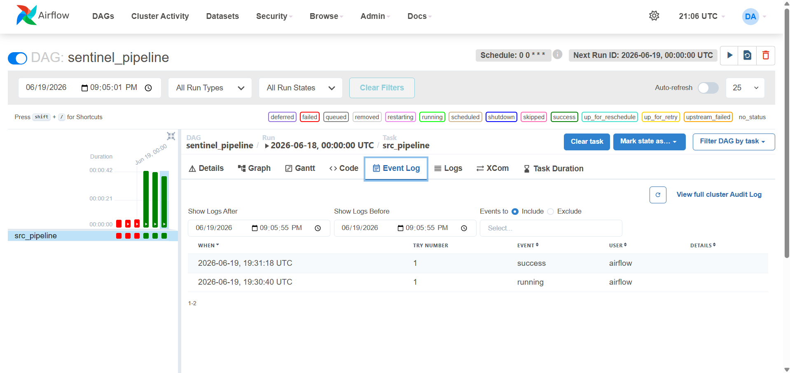

# DATAFLOW-SENTINEL — Operational Runbook

This document defines the **alerting behavior, failure conditions, and operational response procedures** for the Dataflow Sentinel pipeline.

It functions as a lightweight **runbook** for maintainers and reflects production-oriented operational standards.

---

## 1. Alerting & Monitoring Overview

Pipeline health signals are surfaced through multiple monitoring layers:

* **GitHub Actions** – CI execution status and logs
* **Email notifications** – success / failure alerts
* **Sentry** – runtime exception tracking with full stack traces
* **Apache Airflow UI** – real‑time DAG status, task logs, and historical runs
* **dbt test** – data quality and schema validation for the analytics layer (run manually, not yet alerted on)

Email alerts are triggered for:

* ✅ Successful scheduled run
* ❌ Failed scheduled run

Sentry captures:

* Unhandled runtime exceptions
* Full stack traces
* Environment context (local / Docker / CI)

Airflow provides:

* Visual DAG graph with task dependencies
* Individual task logs and stdout/stderr
* Retry attempts and failure reasons
* Scheduler health and DAG run timelines

### Design Principles

* Alerts are intentionally minimal and mobile‑friendly
* Detailed logs and artifacts are available within GitHub Actions and Airflow UI
* Runtime errors are persisted externally via Sentry
* Failures must always be actionable
* Silent failures are unacceptable

> **Scope note:** Sections 1–6 below cover the core pipeline (Ingestion → Validation → Storage → Metrics), which is scheduled, alerted, and monitored as described. The dbt/BigQuery analytics layer is **not** part of this alerting surface — it runs manually and has no email/Sentry/Airflow coverage. Its own failure modes and recovery steps are covered separately in **Section 7**.

---

## 2. 🚨 Alert Conditions

The pipeline owner or on‑call maintainer must investigate immediately if any of the following occur:

### 2.1 Execution Failure

* GitHub Actions workflow fails
* Unhandled exception during pipeline run
* Non‑zero exit status
* Airflow DAG run ends with **failed** state

### 2.2 Data Freshness Violation

If `data/gold/freshness.json` reports:

```json
{"status": "STALE"}
```

This indicates:

* Upstream ingestion delay
* Market holiday or source outage
* Validation failure preventing promotion
* Pipeline regression

### 2.3 Missing Layer Updates

If either condition occurs:

* No new Bronze or Silver outputs for **two consecutive scheduled runs**
* `data/gold/aggregates.csv` missing, empty, or unchanged

This signals possible ingestion failure or blocked promotion.

### 2.4 Airflow‑Specific Alerts

* Scheduler not running or unhealthy
* DAG not triggered at scheduled time
* Tasks stuck in **running** state for extended period

---

## 3. 🔍 Incident Response Procedure

Follow the steps in order.

---

### Step 1 — Inspect GitHub Actions

* Open the failed workflow run
* Review step‑level logs
* Identify the failing module (Ingestion, Validation, Storage, or Metrics)


Do not rerun blindly without reviewing logs.

---

### Step 1A — Inspect Airflow UI

If the pipeline is orchestrated via Airflow:

1. Open the Airflow UI (typically `http://localhost:8080` when running locally, or the deployed URL).
2. Go to the **DAGs** list and find `sentinel_dag`.
3. Check the **last run** status (success/failed/running).
4. Click into the DAG run and inspect each task:

   * Hover over task circles to see statuses
   * Click on a failed task → **Log** tab to view detailed output
   * Review the **Graph** view to confirm dependency flow



5. Verify the **scheduler** is healthy (check the **Scheduler** tab or system logs).

If the DAG is not triggered at the expected time:

* Confirm the schedule interval is correctly set.
* Check the `start_date` and `catchup` settings.
* Ensure the scheduler process is running.

---

### Step 1B — Inspect Sentry (Runtime Errors)


If the pipeline fails due to an unhandled exception:

1. Open the Sentry dashboard
2. Locate the most recent event
3. Inspect:

   * Stack trace
   * Affected module

Sentry provides:

* Faster root cause identification
* Persistent error history across runs
* Aggregated recurring failure insights

If no Sentry event exists:

* Confirm `SENTRY_DSN` is configured
* Verify environment variable injection in CI or Airflow environment
* Ensure monitoring initialization executes before pipeline logic

---

### Step 2 — Attempt Local Reproduction

Run:

```bash
make test
make docker_test
```

If the issue reproduces locally, the root cause is deterministic.

If not, investigate environment‑specific differences (e.g., Airflow vs. direct execution).

---

### Step 3 — Inspect Pipeline Logs

Review structured logs under:

* `logs/`
* `logs/pipeline.json`

Additionally, Airflow task logs are stored in the Airflow home (usually `airflow/logs/`) and viewable via the UI.

Focus on:

* Tracebacks
* Validation errors
* Storage write failures
* Data volume anomalies

---

### Step 4 — Verify Source Availability

Check:

* Yahoo Finance availability
* Market holidays

If the external source is unavailable, document the incident and monitor next scheduled run.

---

### Step 5 — Verify Database Health

Confirm:

* PostgreSQL service is running (neon)
* Credentials are valid
* Connection pool is functional
* No insertion conflicts or schema drift

Environment mapping:

* Local → Neon PostgreSQL
* Docker → Local PostgreSQL container (or specified in compose)
* GitHub Actions → Neon PostgreSQL
* Airflow → Neon PostgreSQL

---

## 4. 🛠️ Recovery Actions

Recovery actions depend on failure classification.

---

### 4.1 Ingestion Failures

If ingestion fails:

* Manually re‑run via GitHub Actions (workflow_dispatch)
  OR
* Execute locally:

```bash
make run
make docker_run
```

* In Airflow, trigger the DAG again:

```bash
make trigger
```

or via UI (click the ▶ button).

Verify Bronze output is regenerated.

---

### 4.2 Validation Failures

If validation blocks promotion:

* Inspect malformed Bronze‑layer CSV files
* Check for upstream schema changes
* Confirm required fields remain present
* Review Pydantic schema enforcement rules

Never bypass validation without understanding the cause.

---

### 4.3 Gold Layer Failures

If metrics or aggregation fails:

* Confirm Silver completeness
* Recompute aggregates after upstream resolution
* Validate freshness logic

Gold failures are usually downstream symptoms.

---

### 4.4 Docker / Environment Failures

If containerization fails:


```bash
make docker_clean
make docker_all
```

Rebuild environment to eliminate stale state.

For Airflow‑related container issues:

```bash
make down
make up
```

to restart the entire Airflow stack.

---

### 4.5 Airflow Task Failures

If a task fails (e.g., `ingest_task`):

1. Inspect the task log via Airflow UI.
2. Fix the underlying issue (code, configuration, external service).
3. Clear the failed task and its downstream tasks (Airflow UI → select task → **Clear**).
4. Rerun the DAG – Airflow will re‑execute cleared tasks.

If tasks are stuck in **running**:

* Check scheduler and worker logs.
* Restart the scheduler (`make down` / `make up`).

---

## 5. ✅ Healthy Run Signals

A successful pipeline execution produces:

* New files in `data/bronze/`
* Validated outputs in `data/silver/`
* Updated `data/gold/aggregates.csv`
* `data/gold/freshness.json` reporting:

```json
{"status": "FRESH"}
```

Additionally:

* Logs show deterministic execution flow
* No validation errors
* No skipped assets
* GitHub Actions status: **Success**
* Airflow DAG run status: **Success** (all tasks marked green)
* No unhandled exceptions in Sentry

For the dbt/BigQuery analytics layer specifically, a healthy run produces:

* `dbt run`: all models reported `OK created` with zero errors
* `dbt test`: all tests `PASS`
* Row count in `sentinel_raw.raw_market_data` matches (or sensibly exceeds) the prior run — a large unexplained drop signals an export problem, not a dbt problem

---

## 6. Operational Philosophy

Dataflow Sentinel is treated as a **production‑inspired data pipeline**.

Principles:

* Fail fast
* Never silently ignore corruption
* Validate before promotion
* Prefer reproducibility over convenience
* Re‑runs must be safe (idempotency guaranteed)
* Runtime errors must be observable (CI + Sentry + Airflow UI)

Failures are expected.

**Silent or unhandled failures are not acceptable.**

---

## 7. 🧱 Analytics Layer (dbt + BigQuery) — Failure Modes & Recovery

This section covers the export script and dbt project separately from the core pipeline above, since it runs independently and is not covered by the alerting in Section 1.

### 7.1 Alert Conditions

Because this layer has no automated alerting yet, these must be checked manually:

* `python -m warehouse_export.export_to_bigquery` exits non‑zero or logs `Export failed`
* `dbt run` reports any model with status other than `OK`
* `dbt test` reports any `FAIL` (as opposed to the one *expected*, documented exception described in Section 7.4)
* Row count in BigQuery's `sentinel_raw.raw_market_data` is unexpectedly low or zero after an export run

### 7.2 Incident Response Procedure

**Step 1 — Check the export script output.**
The script logs each stage (Neon connection, row count read, BigQuery load, final row count). A failure at the Neon-read stage points to a Postgres/credentials issue; a failure at the BigQuery-load stage points to a GCP/permissions issue.

**Step 2 — Verify Neon connectivity independently.**
Confirm the `NEON_DB_URL` in `.env` is current and the Silver table (`market_data`) is reachable — the same database health checks from Section 3, Step 5 apply here.

**Step 3 — Verify BigQuery/GCP credentials.**
Confirm:

* `BQ_KEYFILE_PATH` points to a valid, un-expired service account JSON key
* The service account still has `BigQuery Data Editor` and `BigQuery Job User` roles (IAM changes can silently revoke these)
* The GCP project has not hit a billing or quota issue (check the Cloud Console billing page)

**Step 4 — Re-run the export, then dbt, in order.**
dbt depends on the export having run first — if `dbt run` fails with a missing-table error, the export likely did not complete successfully. Always re-run the export before re-running dbt.

```bash
python -m warehouse_export.export_to_bigquery
cd sentinel_dbt
dbt run
dbt test
```

**Step 5 — Inspect the specific dbt error.**
`dbt run`/`dbt test` output names the exact model and compiled SQL file on failure (under `target/compiled/`) — inspect that file directly rather than guessing from the model name alone.

### 7.3 Recovery Actions

| Failure | Recovery |
|---|---|
| Neon connection failure | Verify `NEON_DB_URL`, confirm Neon instance is awake (Neon free tier can suspend idle instances) |
| BigQuery auth failure | Regenerate service account key if expired/revoked; re-check IAM roles |
| `dbt run` fails on a model | Inspect compiled SQL under `target/compiled/`; check for a source schema change upstream |
| `dbt test` fails unexpectedly (not the known `close` nulls) | Treat as a genuine data quality finding — investigate before suppressing the test |
| Row count drops sharply after export | Check Neon directly first — confirms whether the Silver table itself lost rows, or the export/load step is at fault |

### 7.4 Known, Accepted Test Exception

The raw BigQuery source does **not** carry a `not_null` test on `close`, because 19 rows (of ~19,154) are expected to have a null `close` value due to a same-day data-fetch timing gap at the source (see `ARCHITECTURE.md`, Section 14.5, for the full investigation). The real guarantee is enforced one layer downstream: `stg_market_data` filters these rows out, and its own `not_null` test on `close_price` confirms the cleaned output is always complete. If `dbt test` ever fails on `not_null_stg_market_data_close_price`, that is a genuine regression and must be investigated — it is not the same known exception.

### 7.5 Isolation Guarantee

A failure anywhere in this layer — export script, BigQuery, or dbt — **cannot** affect the core pipeline (Sections 1–6). The analytics layer only reads from Neon; it never writes to it, and it is not imported by, or triggered from, `src/pipeline.py`, the Airflow DAG, or any GitHub Actions workflow.
